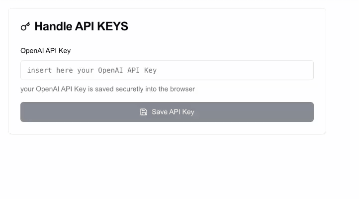

# 🤖 AI Image Auto-Labeling Platform

A modern web application for automated image labeling using OpenAI's GPT-4 Vision API. This project provides a streamlined interface for managing API keys and processing batches of images with custom prompts.

## 📸 Screenshots



*Secure API key management interface*


*Batch image processing with progress tracking*


*Export results in various formats*

## ✨ Features

- **Secure API Key Management**
  - Encrypted storage of OpenAI API keys
  - User-friendly interface for key management
  - Secure client-server communication

- **Batch Image Processing**
  - Support for multiple image uploads
  - Custom prompt configuration
  - Progress tracking for batch operations
  - Efficient batch processing with pagination

- **Results Export**
  - Simple two-column TXT file export
  - Format: image path + classification
  - Easy to parse for further processing
  - Compatible with most ML training pipelines

- **Modern Tech Stack**
  - Next.js 14 with App Router
  - TypeScript for type safety
  - Tailwind CSS for styling
  - shadcn/ui for beautiful UI components
  - Server-side API integration with OpenAI

## 🚀 Getting Started

1. **Clone the repository**
```bash
git clone [your-repo-url]
cd [your-repo-name]
```

2. **Install dependencies**
```bash
npm install
```

3. **Set up environment variables**
Create a `.env.local` file with:
```env
OPENAI_API_KEY=your_default_key_here  # Optional
```

4. **Run the development server**
```bash
npm run dev
```

Open [http://localhost:3000](http://localhost:3000) to view the application.

## 🏗️ Project Structure

```
src/
├── app/
│   ├── api/            # API routes for key management and image processing
│   └── profile/        # User profile and API key management interface
├── components/         # Reusable UI components
├── types/             # TypeScript type definitions
└── utils/             # Utility functions
```

## 📁 Export Format

The exported TXT files contain two columns separated by a space:
```
/path/to/image1.jpg 1
/path/to/image2.jpg 2
/path/to/image3.jpg 1
/path/to/image4.jpg 2
```

Each line contains:
- Full path to the image
- Classification result (1 or 2)

This simple format makes it easy to:
- Use the results in ML training pipelines
- Process with standard text tools
- Import into other applications
- Verify results manually

## 🔒 Security

- API keys are stored securely
- All API routes are properly validated
- Error handling and logging implemented
- Rate limiting and request validation in place

## 🤝 Contributing

1. Fork the repository
2. Create your feature branch (`git checkout -b feature/AmazingFeature`)
3. Commit your changes (`git commit -m 'Add some AmazingFeature'`)
4. Push to the branch (`git push origin feature/AmazingFeature`)
5. Open a Pull Request

## 📝 License

This project is licensed under the MIT License - see the [LICENSE](LICENSE) file for details.